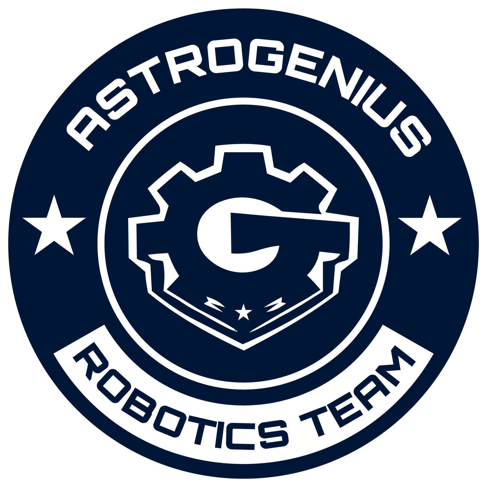

<p align="center">
  
</p>

<h1 align="center">AstroPUP</h1>

<p align="center">
  A lightweight safety and diagnostics layer for PUPRemote communication between LEGO Pybricks hubs and external MicroPython devices.
</p>

<p align="center">
  <a href="https://github.com/luanveras3/AstroPUP/blob/main/LICENSE">
    
  </a>
  
  
  
  
</p>

<p align="center">
  Developed by <strong>Astrogenius Team from Brazil</strong><br>
  Maintained by <strong>Luan Veras</strong><br>
  Instagram: <a href="https://www.instagram.com/astrogenius.team/">@astrogenius.team</a>
</p>

---

## Overview

**AstroPUP** is a small helper layer built on top of **PUPRemote**.

It is designed to make communication between a LEGO hub running **Pybricks** and an external **MicroPython** device safer, easier to debug, and more reliable during robotics projects and competitions.

AstroPUP does not replace PUPRemote or LPF2.  
It adds a higher-level layer for:

- safe calls
- safe processing
- startup diagnostics
- remote mode validation
- call statistics
- last good response tracking
- optional heartbeat / stale-data detection

---
## Testing

AstroPUP includes automated tests for internal logic using `pytest` and GitHub Actions.

These tests validate imports, heartbeat tracking, command order helpers, and sensor-side frame ID helpers.

Automated tests do not replace real LPF2 / Powered Up hardware validation.

For real hardware validation, see:

```
docs/HARDWARE_TEST_CHECKLIST.md
```

## Communication model

AstroPUP is intended for this kind of setup:

```text
External MicroPython Device  <-->  LEGO Hub running Pybricks
```

Example external devices:

- LMS-ESP32
- OpenMV
- ESP32
- RP2040
- other MicroPython boards capable of LPF2 / Powered Up communication

---

## What AstroPUP is

AstroPUP is:

- a helper layer for PUPRemote
- a safer way to call remote commands
- a diagnostics tool for LPF2 / Powered Up communication
- a generic bridge layer for custom sensors and external processors
- useful for robotics education, competitions, and experiments

---

## What AstroPUP is not

AstroPUP is **not**:

- a new protocol
- a replacement for PUPRemote
- a replacement for Pybricks
- a replacement for LPF2 / Powered Up
- a robot framework
- a mission strategy library
- a sensor-specific library

AstroPUP does not know anything about your robot, your sensors, your camera, your line follower, or your competition rules.

Your project-specific logic should stay in your own files, such as:

```text
main.py
robot.py
sensors.py
profiles.py
```

---

## Repository structure

<!-- ASTROPUP_TREE_START -->

```text
AstroPUP/
├── .github/
│   └── workflows/
│       ├── check-readme-tree.yml
│       └── tests.yml
├── assets/
│   └── astrogenius_logo.png
├── docs/
│   ├── HARDWARE_TEST_CHECKLIST.md
│   └── HEARTBEAT_GUIDE.md
├── examples/
│   ├── astrogenius_style_bridge/
│   │   ├── hub_read_example.py
│   │   ├── README.md
│   │   └── sensor_lms_main_example.py
│   ├── basic_sensor/
│   │   ├── hub_main.py
│   │   ├── README.md
│   │   └── sensor_main.py
│   ├── heartbeat_stale_demo/
│   │   ├── hub_main.py
│   │   ├── README.md
│   │   └── sensor_main.py
│   ├── LMS_ESP32_hello_world/
│   │   ├── esp32_main.py
│   │   ├── hub_main.py
│   │   └── README.md
│   ├── OpenMV_hello_camera/
│   │   ├── hub_main.py
│   │   ├── openmv_main.py
│   │   └── README.md
│   ├── pybricks_multitask_hub/
│   │   ├── hub_main.py
│   │   └── README.md
│   └── startup_diagnostics/
│       ├── hub_main.py
│       └── README.md
├── src/
│   ├── astropup_hub.py
│   ├── astropup_sensor.py
│   └── lpf2.py
├── tests/
│   ├── conftest.py
│   ├── test_command_order.py
│   ├── test_heartbeat.py
│   ├── test_imports.py
│   └── test_sensor_frame_id.py
├── tools/
│   ├── README_INSTRUCTIONS.md
│   └── update_readme_tree.py
├── CHANGELOG.md
├── CONTRIBUTING.md
├── CREDITS.md
├── LICENSE
├── README.md
└── SECURITY.md
```

<!-- ASTROPUP_TREE_END -->

## Required files

### On the LEGO Hub

Copy this file to your Pybricks project:

```text
src/astropup_hub.py
```

Then import it:

```python
from astropup_hub import AstroPUPHub
```

---

### On the external MicroPython device

Copy this file to your external device:

```text
src/astropup_sensor.py
```

Then import it:

```python
from astropup_sensor import AstroPUPSensor
```

---

### About `lpf2.py`

`lpf2.py` is the low-level LPF2 / Powered Up implementation derived from PUPRemote.

Some devices already include the required LPF2/PUPRemote support.  
Other MicroPython devices may need `lpf2.py` copied manually.

| Device / Environment | Files usually needed |
| --- | --- |
| LEGO Hub with Pybricks | `astropup_hub.py` |
| LMS-ESP32 with PUPRemote firmware | `astropup_sensor.py` |
| OpenMV | `astropup_sensor.py` + `lpf2.py` |
| ESP32 MicroPython | `astropup_sensor.py` + `lpf2.py` |
| RP2040 MicroPython | `astropup_sensor.py` + `lpf2.py` |
| Other MicroPython boards | `astropup_sensor.py` + `lpf2.py` |

If your device already provides `lpf2.py` internally, you do not need to copy it again.

---

## Minimal sensor-side example

Run this on the external MicroPython device.

```python
from astropup_sensor import AstroPUPSensor

sensor = AstroPUPSensor(profile="competition", debug=False)

def reset():
    return (1,)

def state():
    value_1 = 123
    value_2 = -45
    return (value_1, value_2)

sensor.add_command("reset", "B", callback=reset)
sensor.add_command("state", "hh", callback=state)

while True:
    sensor.safe_process()
```

---

## Minimal hub-side example

Run this on the LEGO hub with Pybricks.

```python
from pybricks.parameters import Port
from pybricks.tools import wait
from astropup_hub import AstroPUPHub

link = AstroPUPHub(Port.C, profile="debug", debug=True)

link.add_command("reset", "B")
link.add_command("state", "hh")

print(link.startup_report())

while True:
    data = link.safe_call("state", default=None)
    print(data)
    wait(100)
```

---

## Command registration rule

The hub side and the sensor side must register commands in the same:

1. order
2. names
3. formats

For example:

### Sensor side

```python
sensor.add_command("reset", "B", callback=reset)
sensor.add_command("state", "hh", callback=state)
```

### Hub side

```python
link.add_command("reset", "B")
link.add_command("state", "hh")
```

If the order, name, or format does not match, communication may fail or return unexpected data.

While debugging, use:

```python
print(link.startup_report())
print(link.validate_remote_modes())
```

---

## Heartbeat / stale-data tracking

AstroPUP can optionally track whether the hub is receiving fresh data or repeated data.

This is useful when stale sensor values could cause incorrect robot behavior.

### Sensor side

```python
def state():
    frame_id = sensor.next_frame_id()
    value_1 = 123
    value_2 = -45
    return (frame_id, value_1, value_2)

sensor.add_command("state", "hhh", callback=state)
```

### Hub side

```python
link.add_command("state", "hhh")

data = link.safe_call("state", default=None)

if data is not None:
    frame_id, value_1, value_2 = data

    fresh = link.track_frame(frame_id)

    print("fresh:", fresh)
    print("stale:", link.is_stale())
    print("stale_count:", link.stale_count())
```

For more details, see:

```text
docs/HEARTBEAT_GUIDE.md
```

---

## Pybricks multitask example

For Pybricks programs using `multitask`, use `safe_call_multitask()`.

```python
from pybricks.parameters import Port
from pybricks.tools import wait, multitask, run_task
from astropup_hub import AstroPUPHub

link = AstroPUPHub(Port.C, profile="competition", debug=False)

link.add_command("reset", "B")
link.add_command("state", "hh")

async def pup_loop():
    while True:
        await link.process_async()
        await wait(0)

async def read_loop():
    while True:
        data = await link.safe_call_multitask("state", default=None)

        if data is not None:
            value_1, value_2 = data
            print(value_1, value_2)

        await wait(0)

async def main():
    await multitask(pup_loop(), read_loop())

run_task(main())
```

---

## Recommended workflow

1. Start with `examples/00_basic_counter_pair`.
2. Confirm that the hub can read values from the external device.
3. Add `startup_report()` while debugging.
4. Add `validate_remote_modes()` to confirm mode registration.
5. Add heartbeat tracking only after basic communication is stable.
6. Move robot-specific logic to your own project files.

---

## Example projects

| Example | Purpose |
| --- | --- |
| `00_basic_counter_pair` | Minimal working hub/sensor pair |
| `01_startup_diagnostics` | Startup reports and validation |
| `02_pybricks_multitask_reader` | Pybricks multitask usage |
| `03_heartbeat_stale_demo` | Frame tracking and stale-data detection |
| `04_saturn_style_bridge` | Example of a more realistic bridge-style setup |

---

## Credits

AstroPUP is based on and derived from **PUPRemote** by Anton's Mindstorms.

Original project:

```text
https://github.com/AntonsMindstorms/PUPRemote
```

PUPRemote provides the LPF2 / Powered Up emulation foundation and the original hub/sensor communication approach.

AstroPUP adds a higher-level helper layer focused on safer usage, diagnostics, and competition-friendly reliability tools.

See:

```text
CREDITS.md
```

---

## License

AstroPUP includes code derived from PUPRemote.

PUPRemote is distributed under the GPL-3.0 license.  
AstroPUP is released under GPL-3.0-compatible terms and keeps attribution to the original PUPRemote project.

See:

```text
LICENSE
CREDITS.md
```

---

## Disclaimer

AstroPUP is an independent open-source project.

It is not affiliated with, endorsed by, or sponsored by:

- LEGO Group
- Pybricks
- Anton's Mindstorms
- PUPRemote

LEGO, SPIKE, MINDSTORMS, Powered Up, and related names are trademarks of their respective owners.

---

## Development status

Current development version:

```text
v0.3.0
```

AstroPUP is under active development and should be tested carefully before use in competition runs.

---

## Related projects

- [Pybricks](https://pybricks.com/)
- [PUPRemote](https://github.com/AntonsMindstorms/PUPRemote)
- [Anton's Mindstorms](https://www.antonsmindstorms.com/)
